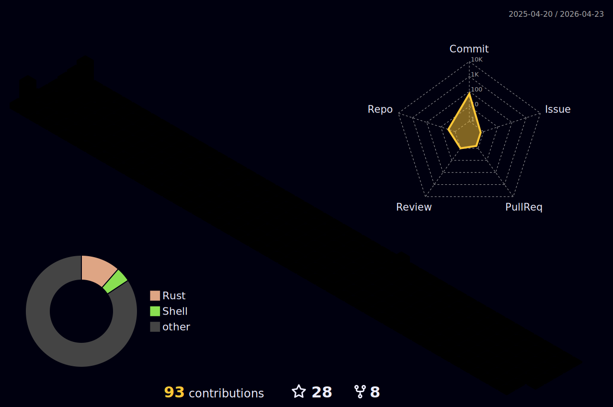

<h1 align="center">
Hi, I'm Sahil!
	
</h1>

## <picture></picture> **About me**

 

- Full Stack/Software Developer
- Intern at [Helmer](https://github.com/helmerapp)
- Ex-Intern at [Tailcall](https://github.com/tailcallhq), [RustDesk](https://github.com/rustdesk/rustdesk) ([My contributions](https://github.com/rustdesk/rustdesk/pulls?q=is:pr+author:beelchester))
- Currently Pursuing BTech in Computer Science
- Skills : Rust, Go, Flutter, Next.js, React, React Native, Redux, Node, Express, GraphQL, Prisma, MongoDB, PostgreSQL, TypeScript, Python, Docker, MaterialUI
  
 

## <picture></picture><b> Github Stats </b>

<!--

-->
